# SecBeat

**A Rust-based Distributed Denial of Service (DDoS) mitigation and Web Application Firewall (WAF) platform**

[](https://fabriziosalmi.github.io/secbeat)
[](https://www.rust-lang.org)
[](LICENSE)

> 🌐 **[View Full Documentation →](https://fabriziosalmi.github.io/secbeat)**

SecBeat is a distributed security platform built in Rust that provides Distributed Denial of Service (DDoS) mitigation and Web Application Firewall (WAF) capabilities. The platform implements a "smart edge, intelligent orchestrator" architecture where mitigation nodes handle traffic processing while a central orchestrator provides coordination and intelligence.

**Current Status:** Early development (v0.9.2) - Not recommended for production use

## Quick Start

Prerequisites: Rust 1.78+, Docker 20.10+, Docker Compose 1.29+

```bash
# Clone the repository
git clone https://github.com/fabriziosalmi/secbeat.git
cd secbeat

# Build the workspace (expected: compilation completes successfully in 2-4 minutes)
cargo build --release --workspace

# Start services (expected: all containers start successfully)
docker-compose up -d

# Verify the deployment (expected: HTML response or connection success)
curl -k https://localhost:8443/
```

## What Works Today

### Core Functionality (Stable)
- **L7 HTTP/HTTPS Proxy**: Async reverse proxy with configurable Transport Layer Security (TLS) termination (Tokio/Rustls)
- **WAF Engine**: 100+ regex-based attack patterns for:
  - Structured Query Language (SQL) injection (~30 rules)
  - Cross-Site Scripting (XSS) (~35 rules)
  - Path traversal (~21 rules)
  - Command injection (~20 rules)
- **TLS Support**: TLS 1.2/1.3 with optional mode (can run plain HTTP)
- **Metrics**: Prometheus-compatible metrics at `/metrics` endpoint
- **Management API**: Health checks, statistics, and dynamic configuration
- **Configuration System**: Unified TOML-based config with environment profiles

### Distributed Features (Beta)
- **NATS Messaging**: Real-time event stream between nodes (NATS.io messaging system)
- **Fleet Management**: Orchestrator tracks and coordinates mitigation nodes
- **Dynamic Rules**: Hot-reload of WAF rules and IP blocklists via API
- **Behavioral Analysis**: Sliding window anomaly detection with automated blocking

### ML/AI Capabilities (Experimental)
- **Anomaly Detection**: Random Forest classifier for traffic pattern analysis (smartcore)
- **Behavioral Expert**: Pattern-based analysis with configurable thresholds
- **Resource Manager**: Linear regression for Central Processing Unit (CPU) usage prediction

### Experimental Features (Linux Only)
- **eBPF/XDP**: Extended Berkeley Packet Filter (eBPF) and eXpress Data Path (XDP) for kernel-level packet processing
  - IP blocklist with HashMap (10,000 entry capacity)
  - PerCpuArray statistics (lock-free counters)
  - <1µs latency, 10M+ packets/second throughput
- **SYN Proxy**: SYN cookie implementation for flood mitigation
  - **Requirements**: Linux 5.15+, `CAP_NET_ADMIN`, `CAP_BPF`
  - **Status**: Functional in LXC, not supported in Docker-in-Docker
- **WASM Runtime**: WebAssembly (WASM)-based WAF rules (Wasmtime) - basic implementation

## Architecture

```mermaid
graph TD
    O[Orchestrator Node<br/>• Fleet Management<br/>• ML-based Anomaly Detection<br/>• Resource Optimization<br/>• Policy Distribution]
    N[NATS Message Bus]
    M1[Mitigation Node 1<br/>• TCP Proxy<br/>• WAF<br/>• TLS]
    M2[Mitigation Node 2<br/>• TCP Proxy<br/>• WAF<br/>• TLS]
    M3[Mitigation Node N<br/>• TCP Proxy<br/>• WAF<br/>• TLS]
    B1[Backend Services]
    B2[Backend Services]
    B3[Backend Services]
    
    O --> N
    N --> M1
    N --> M2
    N --> M3
    M1 --> B1
    M2 --> B2
    M3 --> B3
```



## Operation Modes

SecBeat supports multiple operation modes configured via `[platform.mode]`:

### L7 (Layer 7) Mode - **Recommended**
```bash
# Full feature set: TLS termination + WAF + DDoS protection
cargo run --release -- --config config.l7
```
**Features:**
- HyperText Transfer Protocol Secure (HTTPS)/HyperText Transfer Protocol (HTTP) reverse proxy
- TLS 1.2/1.3 termination
- WAF with 100+ attack patterns
- Behavioral analysis
- Prometheus metrics
- NATS integration (optional)

### SYN Mode - **Experimental**
```bash
# Layer 4 SYN flood protection (Linux only, requires CAP_NET_ADMIN)
sudo cargo run --release -- --config config.syn
```
**Features:**
- SYN cookie validation
- eBPF/XDP packet filtering
- Kernel-level packet dropping
- **Requirements**: Linux 5.15+, `CAP_NET_ADMIN`, `CAP_BPF`

### TCP Mode - **Basic**
```bash
# Simple TCP reverse proxy (no TLS, no WAF)
cargo run --release -- --config config.tcp
```
**Features:**
- Basic TCP proxying
- Connection rate limiting
- Minimal overhead

### Auto Mode
Automatically selects mode based on enabled features in configuration.

## Configuration

SecBeat uses TOML configuration files with a unified platform structure:

```toml
# Platform configuration (config.dev.toml, config.prod.toml)
[platform]
environment = "development"
deployment_id = "mitigation-1"
region = "us-east-1"
features = ["waf", "ddos", "metrics"]
mode = "l7"  # Options: tcp, syn, l7, auto

[network]
public_interface = "0.0.0.0"
public_port = 8443
backend_interface = "127.0.0.1"
backend_port = 8080
max_connections = 10000
connection_timeout_seconds = 30

[network.tls]
enabled = true
cert_path = "certs/cert.pem"
key_path = "certs/key.pem"
min_version = "1.2"
max_version = "1.3"

[waf]
enabled = true
block_sql_injection = true
block_xss = true
block_path_traversal = true
block_command_injection = true

[metrics]
bind_address = "0.0.0.0:9191"
enabled = true

[nats]
url = "nats://localhost:4222"
enabled = false
```

See [Configuration Reference](https://fabriziosalmi.github.io/secbeat/reference/config/) for complete options.

## Development Status

### ✅ Implemented
- [x] TCP reverse proxy (async Tokio)
- [x] TLS 1.2/1.3 termination
- [x] Basic WAF with regex patterns
- [x] NATS-based messaging
- [x] Prometheus metrics
- [x] Management API
- [x] Random Forest anomaly detection
- [x] Behavioral analysis engine
- [x] WASM rule execution (basic)
- [x] Docker deployment

### ⚠️ Experimental
- [ ] eBPF/XDP packet filtering (Linux only, requires CAP_NET_RAW)
- [ ] SYN proxy with cookie validation (prototype, not production-ready)
- [ ] CRDT-based state synchronization (partial implementation)

### 📋 In Development
- [ ] Complete threat intelligence API
- [ ] Enhanced statistics and reporting
- [ ] IP blocklist/allowlist persistence
- [ ] Comprehensive test suite
- [ ] Performance benchmarks
- [ ] Production deployment tooling

### 🔮 Planned
- [ ] HTTP/2 support
- [ ] OWASP ModSecurity CRS integration
- [ ] Advanced ML models (LSTM, Isolation Forest)
- [ ] Dashboard UI
- [ ] Multi-tenant support
- [ ] Cloud provider integrations

## Testing

```bash
# Run unit and integration tests
cargo test --workspace

# Run behavioral analysis test (requires Docker)
./test_behavioral_ban.sh

# Run integration tests
cd mitigation-node && cargo test --test integration_tests
```

> **Note**  
> Test scripts require environment-specific configuration. Refer to individual test files for setup instructions.

## Deployment

### Docker Compose (Recommended for Testing)

```bash
# Start all services (mitigation node + NATS + test backend)
docker-compose up -d

# Expected output:
# Creating network "secbeat_default" done
# Creating secbeat_nats_1 ... done
# Creating secbeat_backend_1 ... done  
# Creating secbeat_mitigation_1 ... done

# View logs
docker-compose logs -f mitigation-node

# Test the deployment
curl -k https://localhost:8443/health
# Expected output:
# {"status":"healthy","version":"0.9.2"}
```

### Native Linux (Production)

For eBPF/XDP features and optimal performance:

```bash
# Build release binary
cargo build --release --workspace

# Grant required capabilities for SYN proxy mode
sudo setcap cap_net_admin,cap_bpf,cap_net_raw=eip target/release/mitigation-node

# Run in L7 mode
./target/release/mitigation-node --config config.prod

# Or use systemd service
sudo cp systemd/secbeat-mitigation.service /etc/systemd/system/
sudo systemctl daemon-reload
sudo systemctl enable --now secbeat-mitigation
```

**Production Requirements:**
- Linux kernel 5.15+ (for eBPF/XDP)
- Rust 1.78+
- TLS certificates
- NATS server (for distributed deployment)

See [Installation Guide](https://fabriziosalmi.github.io/secbeat/installation/) for detailed instructions.

### Docker (Development)

```bash
docker-compose up -d
```

### Kubernetes (Experimental)

```bash
kubectl apply -f k8s/
```

### Bare Metal

```bash
# Build release binaries
cargo build --release --workspace

# Install binaries
sudo cp target/release/mitigation-node /usr/local/bin/
sudo cp target/release/orchestrator-node /usr/local/bin/

# Set capabilities for SYN proxy (if using)
sudo setcap cap_net_raw,cap_net_admin+ep /usr/local/bin/mitigation-node
```

See [Installation Guide](https://fabriziosalmi.github.io/secbeat/installation/) for detailed instructions.

## Monitoring

SecBeat exposes Prometheus metrics on port 9191:

```bash
curl http://localhost:9191/metrics
```

**Expected output:**
```
# HELP secbeat_requests_total Total HTTP requests
# TYPE secbeat_requests_total counter
secbeat_requests_total 1234
...
```

Key metrics include:
- `secbeat_requests_total` - Total HTTP requests processed
- `secbeat_blocked_total` - Total blocked attacks
- `secbeat_response_time_seconds` - Request latency
- `secbeat_connections_active` - Active connections

## API Reference

### Management API (Mitigation Node)

```bash
# Health check (expected: JSON with status, uptime, active connections)
GET http://localhost:9999/api/v1/status
# Expected response:
# {"status":"running","uptime_seconds":123,"active_connections":5}

# Block an IP (expected: 200 OK with confirmation message)
POST http://localhost:9999/api/v1/blocklist
Content-Type: application/json
{
  "ip": "192.0.2.100",
  "duration_seconds": 3600
}
# Expected response:
# {"success":true,"message":"IP blocked for 3600 seconds"}
```

### Control API (Orchestrator)

```bash
# List fleet nodes (expected: JSON array of node objects with status)
GET http://localhost:3030/api/v1/nodes
# Expected response:
# [{"id":"node-1","status":"active","last_seen":"2025-11-23T10:30:00Z"}]

# Get node metrics (expected: JSON object with metrics data)
GET http://localhost:3030/api/v1/nodes/{id}/metrics
# Expected response:
# {"requests_total":1234,"blocked_total":56,"cpu_percent":12.5}
```

See [API Reference](https://fabriziosalmi.github.io/secbeat/reference/api/) for complete documentation.

## Known Limitations

1. **SYN Proxy**: Experimental only, not suitable for production
2. **eBPF/XDP**: Linux only, requires kernel 5.15+ and CAP_NET_RAW
3. **WASM Runtime**: Basic implementation, limited rule complexity
4. **Test Coverage**: Integration tests need environment-specific adjustments
5. **Documentation**: Some features documented but implementation incomplete
6. **Performance**: Not yet optimized for high-throughput scenarios
7. **Stability**: Early development, breaking changes expected

## Requirements

### Minimum Versions
- **Rust**: 1.78 or later
- **Docker**: 20.10 or later
- **Docker Compose**: 1.29 or later
- **Operating System**: Linux (recommended) or macOS for development
- **Linux Kernel**: 5.15+ for eBPF/XDP features (Linux only)
- **Memory**: 4GB RAM minimum, 8GB recommended
- **Privileges**: Root or CAP_NET_RAW capability for SYN proxy mode

## Contributing

This is an early-stage project. Contributions are welcome, but be aware of the current development status.

Before contributing:

1. Review the [documentation](https://fabriziosalmi.github.io/secbeat)
2. Check existing issues and pull requests
3. Set up the development environment (see CONTRIBUTING.md)
4. Test your changes thoroughly
5. Follow Rust best practices and project coding standards

For detailed guidelines, see [CONTRIBUTING.md](CONTRIBUTING.md).

## Documentation

- [Quick Start Guide](https://fabriziosalmi.github.io/secbeat/quickstart/)
- [Installation](https://fabriziosalmi.github.io/secbeat/installation/)
- [Architecture Overview](https://fabriziosalmi.github.io/secbeat/core/overview/)
- [API Reference](https://fabriziosalmi.github.io/secbeat/reference/api/)
- [Configuration Reference](https://fabriziosalmi.github.io/secbeat/reference/config/)

## License

MIT License - see [LICENSE](LICENSE) for details.

## Acknowledgments

Built with:
- [Tokio](https://tokio.rs/) - Async runtime
- [Rustls](https://github.com/rustls/rustls) - TLS implementation
- [NATS](https://nats.io/) - Messaging system
- [Wasmtime](https://wasmtime.dev/) - WebAssembly runtime
- [smartcore](https://smartcorelib.org/) - Machine learning library

## Project Status

**Current Version:** 0.1.0 (Early Development)

This project is under active development. Features and APIs are subject to change. **Not recommended for production use (v0.1.x)**.

For production DDoS mitigation, consider established solutions like:
- Cloudflare
- AWS Shield
- Fastly
- Akamai

Use SecBeat for:
- Learning Rust systems programming
- Experimenting with DDoS mitigation techniques
- Research and development
- Non-critical environments

---

**⚠️ Important**: This is a development project. Do not deploy to production without thorough testing and understanding of its limitations.
