# SecBeat

**A Rust-based Distributed Denial of Service (DDoS) mitigation and Web Application Firewall (WAF) platform**

[](https://fabriziosalmi.github.io/secbeat)
[](https://www.rust-lang.org)
[](LICENSE)
[](https://github.com/fabriziosalmi/secbeat/releases)
[](https://github.com/fabriziosalmi/secbeat/releases/tag/v0.9.5)
[](https://github.com/fabriziosalmi/secbeat/actions/workflows/test.yml)

> 🌐 **[View Full Documentation →](https://fabriziosalmi.github.io/secbeat)**

> ⚠️ **BETA SOFTWARE (v0.9.5)** - This is pre-1.0 software under active development. Not recommended for production use. Expect breaking changes and potential stability issues.

SecBeat is a distributed security platform built in Rust that provides Distributed Denial of Service (DDoS) mitigation and Web Application Firewall (WAF) capabilities. The platform implements a "smart edge, intelligent orchestrator" architecture where mitigation nodes handle traffic processing while a central orchestrator provides coordination and intelligence.

## Quick Start

Prerequisites: Rust 1.78+, Docker 20.10+, Docker Compose 1.29+

```bash
# Clone the repository
git clone https://github.com/fabriziosalmi/secbeat.git
cd secbeat

# Build the workspace (expected: compilation completes successfully in 2-4 minutes)
cargo build --release --workspace

# Start services (expected: all containers start successfully)
docker-compose up -d

# Verify the deployment (expected: HTML response or connection success)
curl -k https://localhost:8443/
```

## What Works Today

### Core Functionality (Stable)
- **L7 HTTP/HTTPS Proxy**: Async reverse proxy with configurable Transport Layer Security (TLS) termination (Hyper 1.x/Rustls 0.23)
- **WAF Engine**: 100+ regex-based attack patterns with latency histograms for:
  - Structured Query Language (SQL) injection (~30 rules)
  - Cross-Site Scripting (XSS) (~35 rules)
  - Path traversal (~21 rules)
  - Command injection (~20 rules)
- **TLS Support**: TLS 1.2/1.3 (no-TLS mode removed for security)
- **Metrics**: Prometheus-compatible native metrics (10x faster config reads with ArcSwap)
  - Real-time metric updates (no polling delay)
  - WAF latency histograms (P50/P95/P99 tracking)
  - Lock-free DDoS config reads (50ns → 5ns)
- **Management API**: Health checks, statistics, and dynamic configuration
- **Configuration System**: Unified TOML-based config with environment profiles
- **Error Handling**: Comprehensive thiserror-based error types (replaced anyhow)

### Distributed Features (Beta)
- **NATS Messaging**: Real-time event stream between nodes (NATS.io messaging system)
- **Fleet Management**: Orchestrator tracks and coordinates mitigation nodes
- **Dynamic Rules**: Hot-reload of WAF rules and IP blocklists via API
- **Behavioral Analysis**: Sliding window anomaly detection with automated blocking

### ML/AI Capabilities (Experimental)
- **Anomaly Detection**: Random Forest classifier for traffic pattern analysis (smartcore)
- **Behavioral Expert**: Pattern-based analysis with configurable thresholds
- **Resource Manager**: Linear regression for Central Processing Unit (CPU) usage prediction

### Experimental Features (Linux Only)
- **eBPF/XDP**: Extended Berkeley Packet Filter (eBPF) and eXpress Data Path (XDP) for kernel-level packet processing ✅
  - IP blocklist with HashMap (10,000 entry capacity)
  - PerCpuArray statistics (lock-free counters)
  - SYN cookie generation and XDP_TX response
  - <1µs latency, 10M+ packets/second throughput
  - **Requirements**: Linux 5.15+, `CAP_NET_ADMIN`, `CAP_BPF`
  - **Build**: Requires `cargo +nightly build-ebpf` (separate from main workspace)
- **SYN Proxy**: SYN cookie implementation for flood mitigation (729 lines) ✅
  - Stateless SYN cookie generation and validation
  - Raw packet reception via pnet
  - TCP handshake tracking with automatic cleanup
  - **Requirements**: Linux, `CAP_NET_RAW`
  - **Status**: Functional prototype, production deployment requires kernel integration
- **WASM Runtime**: WebAssembly (WASM)-based WAF rules (Wasmtime 29.x) ✅
  - Hot-reloadable security rules
  - Data-driven JSON configuration
  - 3 example modules: bad-bot, test-runner, universal-waf
  - Fuel-limited execution for safety

## Recent Improvements (v0.9.5)

### Security Updates
- **Wasmtime 29.x**: Updated from v26 to fix CVE-2025-64345 and CVE-2025-53901
- **Dependency Updates**: mdast-util-to-hast security patch

### Documentation
- **eBPF/XDP Status**: Updated to reflect full implementation (232 lines)
- **SYN Proxy Status**: Updated to reflect functional prototype (729 lines)  
- **WASM Runtime**: Documented 3 example modules and hot-reload capability
- **Fixed GitHub links**: Corrected website social links

### Performance Enhancements
- **10x Faster Config Reads**: Replaced `RwLock` with `ArcSwap` for lock-free DDoS config access (50ns → 5ns)
- **Native Metrics**: Migrated from custom macros to metrics crate native implementation (-136 lines)
- **Real-time Updates**: Eliminated 5-second polling delay for metrics

### Security & Reliability
- **Modern Dependencies**: Upgraded to Hyper 1.x and Rustls 0.23
- **No-TLS Mode Removed**: Enforced TLS for security (HTTP-only mode deprecated)
- **Type-Safe Errors**: Migrated from `anyhow` to `thiserror` for better error handling
- **Seccomp Sandboxing**: Added Linux kernel syscall filtering

### Observability
- **WAF Latency Histograms**: Track P50/P95/P99 inspection latency
- **Performance Monitoring**: Detect slow pattern matches and regressions
- **Comprehensive Metrics**: Category labels for blocked requests

### Testing & Quality
- **Test Suite**: 50/55 tests passing (91% success rate on Linux)
  - 29/29 library unit tests ✅
  - 15/17 integration tests ✅
  - 6/9 performance tests ✅
- **Fuzzing Infrastructure**: Property-based testing setup
- **CI/CD**: Automated test suite with GitHub Actions

### Bug Fixes
- Fixed eBPF compilation errors (format hints, panic handler)
- Excluded eBPF from workspace build (requires special tooling)
- Fixed TrafficFeatures and CRDT doctest examples
- Corrected test imports and compilation issues

## Architecture

```mermaid
graph TD
    O[Orchestrator Node<br/>• Fleet Management<br/>• ML-based Anomaly Detection<br/>• Resource Optimization<br/>• Policy Distribution]
    N[NATS Message Bus]
    M1[Mitigation Node 1<br/>• TCP Proxy<br/>• WAF<br/>• TLS]
    M2[Mitigation Node 2<br/>• TCP Proxy<br/>• WAF<br/>• TLS]
    M3[Mitigation Node N<br/>• TCP Proxy<br/>• WAF<br/>• TLS]
    B1[Backend Services]
    B2[Backend Services]
    B3[Backend Services]
    
    O --> N
    N --> M1
    N --> M2
    N --> M3
    M1 --> B1
    M2 --> B2
    M3 --> B3
```



## Operation Modes

SecBeat supports multiple operation modes configured via `[platform.mode]`:

### L7 (Layer 7) Mode - **Recommended**
```bash
# Full feature set: TLS termination + WAF + DDoS protection
cargo run --release -- --config config.l7
```
**Features:**
- HyperText Transfer Protocol Secure (HTTPS)/HyperText Transfer Protocol (HTTP) reverse proxy
- TLS 1.2/1.3 termination
- WAF with 100+ attack patterns
- Behavioral analysis
- Prometheus metrics
- NATS integration (optional)

### SYN Mode - **Experimental**
```bash
# Layer 4 SYN flood protection (Linux only, requires CAP_NET_ADMIN)
sudo cargo run --release -- --config config.syn
```
**Features:**
- SYN cookie validation
- eBPF/XDP packet filtering
- Kernel-level packet dropping
- **Requirements**: Linux 5.15+, `CAP_NET_ADMIN`, `CAP_BPF`

### TCP Mode - **Basic**
```bash
# Simple TCP reverse proxy (no TLS, no WAF)
cargo run --release -- --config config.tcp
```
**Features:**
- Basic TCP proxying
- Connection rate limiting
- Minimal overhead

### Auto Mode
Automatically selects mode based on enabled features in configuration.

## Configuration

SecBeat uses TOML configuration files with a unified platform structure:

```toml
# Platform configuration (config.dev.toml, config.prod.toml)
[platform]
environment = "development"
deployment_id = "mitigation-1"
region = "us-east-1"
features = ["waf", "ddos", "metrics"]
mode = "l7"  # Options: tcp, syn, l7, auto

[network]
public_interface = "0.0.0.0"
public_port = 8443
backend_interface = "127.0.0.1"
backend_port = 8080
max_connections = 10000
connection_timeout_seconds = 30

[network.tls]
enabled = true
cert_path = "certs/cert.pem"
key_path = "certs/key.pem"
min_version = "1.2"
max_version = "1.3"

[waf]
enabled = true
block_sql_injection = true
block_xss = true
block_path_traversal = true
block_command_injection = true

[metrics]
bind_address = "0.0.0.0:9191"
enabled = true

[nats]
url = "nats://localhost:4222"
enabled = false
```

See [Configuration Reference](https://fabriziosalmi.github.io/secbeat/reference/config/) for complete options.

## Development Status

### ✅ Implemented (Production Ready)
- [x] TCP reverse proxy (async Tokio/Hyper 1.x)
- [x] TLS 1.2/1.3 termination (Rustls 0.23)
- [x] WAF with 100+ regex patterns + latency monitoring
- [x] NATS-based messaging (event system)
- [x] Prometheus metrics (native implementation)
- [x] Management API with dynamic updates
- [x] Lock-free config reads (ArcSwap)
- [x] Type-safe error handling (thiserror)
- [x] Seccomp sandboxing (Linux)
- [x] Docker deployment
- [x] Comprehensive test suite (91% passing)

### ⚠️ Experimental
- [x] Random Forest anomaly detection (functional, needs tuning)
- [x] Behavioral analysis engine (sliding window detection)
- [x] WASM rule execution (533 lines, 3 example modules)
- [x] eBPF/XDP packet filtering (232 lines, Linux only, requires CAP_NET_ADMIN + CAP_BPF)
- [x] SYN proxy with cookie validation (729 lines, functional prototype)
- [ ] CRDT-based state synchronization (partial implementation)
- [ ] Orchestrator ML features (minor test issues documented)

### 📋 In Development
- [ ] Complete threat intelligence API
- [ ] Enhanced statistics and reporting
- [ ] IP blocklist/allowlist persistence
- [ ] Comprehensive test suite
- [ ] Performance benchmarks
- [ ] Production deployment tooling

### 🔮 Planned
- [ ] HTTP/2 support
- [ ] OWASP ModSecurity CRS integration
- [ ] Advanced ML models (LSTM, Isolation Forest)
- [ ] Dashboard UI
- [ ] Multi-tenant support
- [ ] Cloud provider integrations

## Testing

### Test Suite Status (v0.9.5)

**Overall**: 50/55 tests passing (91% success rate on Linux)

```bash
# Run all tests
cargo test --workspace --all-features

# Core tests (29/29 passing)
cargo test --package mitigation-node --lib

# Integration tests (15/17 passing, 2 ignored)
cargo test --package mitigation-node --test integration_tests

# Performance tests (6/9 passing)
cargo test --package mitigation-node --test performance_tests
```

### Known Test Issues

See [GitHub Issues](https://github.com/fabriziosalmi/secbeat/issues) for tracked test issues:
- **WASM Tests**: Require pre-built modules ([Issue #2](https://github.com/fabriziosalmi/secbeat/issues/2))
- **Performance Tests**: May fail in resource-constrained environments ([Issue #3](https://github.com/fabriziosalmi/secbeat/issues/3))
- **Orchestrator Tests**: Minor compilation issues in experimental features ([Issue #4](https://github.com/fabriziosalmi/secbeat/issues/4))

> **Note**  
> All core functionality tests pass. Performance and integration test failures are environment-specific and documented.

## Deployment

### Docker Compose (Recommended for Testing)

```bash
# Start all services (mitigation node + NATS + test backend)
docker-compose up -d

# Expected output:
# Creating network "secbeat_default" done
# Creating secbeat_nats_1 ... done
# Creating secbeat_backend_1 ... done  
# Creating secbeat_mitigation_1 ... done

# View logs
docker-compose logs -f mitigation-node

# Test the deployment
curl -k https://localhost:8443/health
# Expected output:
# {"status":"healthy","version":"0.9.2"}
```

### Native Linux (Production)

For eBPF/XDP features and optimal performance:

```bash
# Build release binary
cargo build --release --workspace

# Grant required capabilities for SYN proxy mode
sudo setcap cap_net_admin,cap_bpf,cap_net_raw=eip target/release/mitigation-node

# Run in L7 mode
./target/release/mitigation-node --config config.prod

# Or use systemd service
sudo cp systemd/secbeat-mitigation.service /etc/systemd/system/
sudo systemctl daemon-reload
sudo systemctl enable --now secbeat-mitigation
```

**Production Requirements:**
- Linux kernel 5.15+ (for eBPF/XDP)
- Rust 1.78+
- TLS certificates
- NATS server (for distributed deployment)

See [Installation Guide](https://fabriziosalmi.github.io/secbeat/installation/) for detailed instructions.

### Docker (Development)

```bash
docker-compose up -d
```

### Kubernetes (Experimental)

```bash
kubectl apply -f k8s/
```

### Bare Metal

```bash
# Build release binaries
cargo build --release --workspace

# Install binaries
sudo cp target/release/mitigation-node /usr/local/bin/
sudo cp target/release/orchestrator-node /usr/local/bin/

# Set capabilities for SYN proxy (if using)
sudo setcap cap_net_raw,cap_net_admin+ep /usr/local/bin/mitigation-node
```

See [Installation Guide](https://fabriziosalmi.github.io/secbeat/installation/) for detailed instructions.

## Monitoring

SecBeat exposes Prometheus metrics on port 9191:

```bash
curl http://localhost:9191/metrics
```

**Expected output:**
```
# HELP secbeat_requests_total Total HTTP requests
# TYPE secbeat_requests_total counter
secbeat_requests_total 1234
...
```

Key metrics include:
- `https_requests_received` - Total HTTPS requests received
- `blocked_requests_total` - Total blocked requests
- `ddos_events_detected_total` - DDoS events detected
- `waf_events_blocked_total` - WAF blocks by category
- `waf_inspection_duration_seconds` - WAF latency histogram (P50/P95/P99)
- `active_connections` - Currently active connections (real-time gauge)
- `tls_handshakes_completed` - Successful TLS handshakes
- `requests_proxied` - Requests forwarded to backend

## API Reference

### Management API (Mitigation Node)

```bash
# Health check (expected: JSON with status, uptime, active connections)
GET http://localhost:9999/api/v1/status
# Expected response:
# {"status":"running","uptime_seconds":123,"active_connections":5}

# Block an IP (expected: 200 OK with confirmation message)
POST http://localhost:9999/api/v1/blocklist
Content-Type: application/json
{
  "ip": "192.0.2.100",
  "duration_seconds": 3600
}
# Expected response:
# {"success":true,"message":"IP blocked for 3600 seconds"}
```

### Control API (Orchestrator)

```bash
# List fleet nodes (expected: JSON array of node objects with status)
GET http://localhost:3030/api/v1/nodes
# Expected response:
# [{"id":"node-1","status":"active","last_seen":"2025-11-23T10:30:00Z"}]

# Get node metrics (expected: JSON object with metrics data)
GET http://localhost:3030/api/v1/nodes/{id}/metrics
# Expected response:
# {"requests_total":1234,"blocked_total":56,"cpu_percent":12.5}
```

See [API Reference](https://fabriziosalmi.github.io/secbeat/reference/api/) for complete documentation.

## Known Limitations

1. **SYN Proxy**: Experimental only, not suitable for production
2. **eBPF/XDP**: Linux only, requires kernel 5.15+ and CAP_NET_ADMIN + CAP_BPF
3. **WASM Runtime**: Basic implementation, integration tests require pre-built modules ([Issue #2](https://github.com/fabriziosalmi/secbeat/issues/2))
4. **Performance Tests**: May fail in resource-constrained CI environments ([Issue #3](https://github.com/fabriziosalmi/secbeat/issues/3))
5. **Orchestrator**: Experimental features with minor test issues ([Issue #4](https://github.com/fabriziosalmi/secbeat/issues/4))
6. **HTTP/2**: Not yet implemented (planned for future release)
7. **Multi-tenant**: Not yet supported (planned for future release)

## Requirements

### Minimum Versions
- **Rust**: 1.78 or later
- **Docker**: 20.10 or later
- **Docker Compose**: 1.29 or later
- **Operating System**: Linux (recommended) or macOS for development
- **Linux Kernel**: 5.15+ for eBPF/XDP features (Linux only)
- **Memory**: 4GB RAM minimum, 8GB recommended
- **Privileges**: Root or CAP_NET_RAW capability for SYN proxy mode

## Support Policy

| Version | Status | Support Level |
|---------|--------|---------------|
| 0.9.x   | Active | Bug fixes, security patches, new features |
| < 0.9   | EOL    | No support, upgrade recommended |

**Maintenance Schedule:**
- Security vulnerabilities: Best-effort response within 48 hours
- Bug fixes: Addressed in next minor release
- Feature requests: Evaluated for roadmap inclusion

**This project is NOT recommended for production use.** For production DDoS mitigation, consider Cloudflare, AWS Shield, Fastly, or Akamai. Use SecBeat for learning, research, or non-critical environments.

## Contributing

This is an early-stage project. Contributions are welcome, but be aware of the current development status.

Before contributing:

1. Review the [documentation](https://fabriziosalmi.github.io/secbeat)
2. Check existing issues and pull requests
3. Set up the development environment (see CONTRIBUTING.md)
4. Test your changes thoroughly
5. Follow Rust best practices and project coding standards

For detailed guidelines, see [CONTRIBUTING.md](CONTRIBUTING.md).

## Documentation

- [Quick Start Guide](https://fabriziosalmi.github.io/secbeat/quickstart/)
- [Installation](https://fabriziosalmi.github.io/secbeat/installation/)
- [Architecture Overview](https://fabriziosalmi.github.io/secbeat/core/overview/)
- [API Reference](https://fabriziosalmi.github.io/secbeat/reference/api/)
- [Configuration Reference](https://fabriziosalmi.github.io/secbeat/reference/config/)

## License

MIT License - see [LICENSE](LICENSE) for details.

## Acknowledgments

Built with:
- [Tokio](https://tokio.rs/) - Async runtime
- [Rustls](https://github.com/rustls/rustls) - TLS implementation
- [NATS](https://nats.io/) - Messaging system
- [Wasmtime](https://wasmtime.dev/) - WebAssembly runtime
- [smartcore](https://smartcorelib.org/) - Machine learning library

## Project Status

**Current Version:** 0.9.5 (Beta)

**Progress**: 7/10 critical security improvements complete
- ✅ Hyper 1.0 + Rustls 0.23 upgrade
- ✅ Anyhow → thiserror migration  
- ✅ Seccomp sandboxing
- ✅ Remove no-TLS mode
- ✅ NATS ADR documentation
- ✅ Fuzzing infrastructure
- ✅ Metrics macro replacement
- ✅ ArcSwap performance optimization
- ⏸️ Externalize secrets (planned)
- ⏸️ Property-based testing (infrastructure ready)

This project is under active development. Features and APIs are subject to change. **Not recommended for production use until v1.0**.

For production DDoS mitigation, consider established solutions like:
- Cloudflare
- AWS Shield
- Fastly
- Akamai

Use SecBeat for:
- Learning Rust systems programming
- Experimenting with DDoS mitigation techniques
- Research and development
- Non-critical environments

---

**⚠️ Important**: This is a development project. Do not deploy to production without thorough testing and understanding of its limitations.
