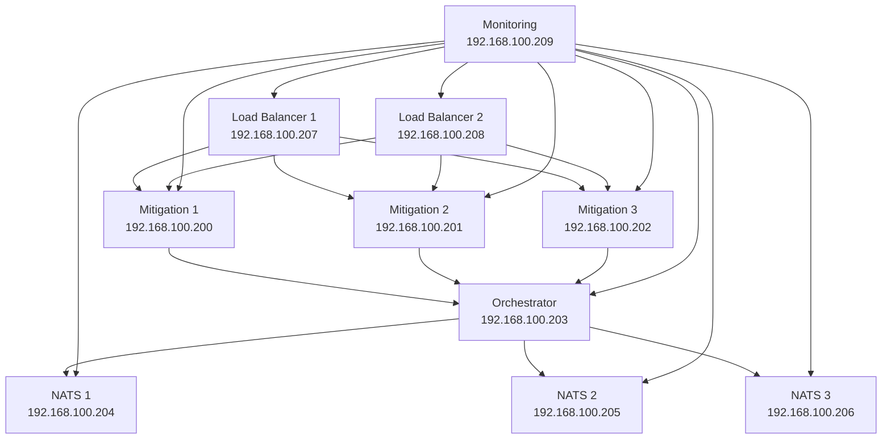

# SecBeat Modern Deployment Guide

## 🎯 Recommended Approach: Hybrid Deployment

After testing different approaches, here's the most robust and maintainable deployment strategy for your SecBeat platform:

### Why Hybrid?

1. **VM Creation**: Use the proven bash scripts for reliable VM provisioning
2. **Configuration Management**: Use Ansible for repeatable, idempotent configuration
3. **Future Flexibility**: Easy to migrate to full Terraform later

## 🚀 Quick Start (Recommended)

### 1. Prerequisites

```bash
# Install Ansible (if not already installed)
brew install ansible  # macOS
# or
sudo apt install ansible  # Ubuntu

# Verify installation
ansible --version
```

### 2. Deploy with Hybrid Approach

```bash
# Test environment first
./deployment/deploy-hybrid.sh test

# Full deployment (VMs + Configuration)
./deployment/deploy-hybrid.sh deploy
```

This approach:
- ✅ Uses proven VM creation scripts
- ✅ Leverages Ansible for modern configuration management
- ✅ Provides consistent, repeatable deployments
- ✅ Easy to maintain and update

## 📋 Available Deployment Methods

### Method 1: Hybrid Deployment (Recommended)
```bash
cd deployment/
./deploy-hybrid.sh deploy
```

**Pros:**
- Most reliable for VM creation
- Modern configuration management
- Best of both worlds
- Easy troubleshooting

### Method 2: Pure Terraform + Ansible (Future)
```bash
cd deployment/
./deploy.sh deploy
```

**Status:** Ready for enhancement once VM provisioning issues are resolved

### Method 3: Traditional Bash Scripts
```bash
./deploy_proxmox.sh deploy
```

**Use case:** Quick deployments, troubleshooting

## 🏗️ Architecture Overview

### Infrastructure (192.168.100.0/24)

| Service | Count | IPs | Resources |
|---------|-------|-----|-----------|
| **Mitigation Nodes** | 3 | .200-.202 | 1GB RAM, 8GB disk each |
| **Orchestrator** | 1 | .203 | 1GB RAM, 8GB disk |
| **NATS Cluster** | 3 | .204-.206 | 512MB RAM, 6GB disk each |
| **Load Balancers** | 2 | .207-.208 | 512MB RAM, 6GB disk each |
| **Monitoring** | 1 | .209 | 1.5GB RAM, 12GB disk |

**Total:** 7.5GB RAM, 80GB disk (fits in 8GB/100GB environment)

### Service Architecture



## 🛠️ Deployment Commands

### Hybrid Deployment Commands

| Command | Description |
|---------|-------------|
| `./deploy-hybrid.sh test` | Test environment and connectivity |
| `./deploy-hybrid.sh deploy` | Full deployment (VMs + config) |
| `./deploy-hybrid.sh vms` | Create VMs only |
| `./deploy-hybrid.sh configure` | Configure existing VMs with Ansible |
| `./deploy-hybrid.sh status` | Check deployment status |
| `./deploy-hybrid.sh destroy` | Destroy all VMs |

### Configuration Management

```bash
# Reconfigure existing VMs
./deploy-hybrid.sh configure

# Update specific service group
cd deployment/ansible
ansible mitigation_nodes -i inventory.ini -m systemd -a "name=secbeat-mitigation state=restarted" --become

# Check service status
ansible all -i inventory.ini -m shell -a "systemctl status secbeat-*" --become
```

## 📊 Post-Deployment Access

### Service URLs
- **Grafana**: http://192.168.100.209:3000 (admin/secbeat123)
- **Prometheus**: http://192.168.100.209:9090
- **HAProxy Stats**: http://192.168.100.207:8404/stats
- **SecBeat API**: https://192.168.100.207/api

### SSH Access
```bash
# Access any VM
ssh -i ~/.ssh/id_rsa secbeat@192.168.100.XXX

# Quick access to specific services
ssh -i ~/.ssh/id_rsa secbeat@192.168.100.200  # Mitigation 1
ssh -i ~/.ssh/id_rsa secbeat@192.168.100.203  # Orchestrator
ssh -i ~/.ssh/id_rsa secbeat@192.168.100.209  # Monitoring
```

## 🔧 Configuration Files

### Ansible Configuration

The Ansible playbook (`deployment/ansible/site.yml`) handles:

- **System Setup**: Base packages, security, firewall
- **SecBeat Deployment**: Source code compilation and deployment
- **Service Configuration**: Systemd services for all components
- **Monitoring Setup**: Prometheus, Grafana, and exporters
- **Security Configuration**: Fail2ban, UFW, SSH hardening

### Key Templates

| Template | Purpose |
|----------|---------|
| `mitigation-node.service.j2` | SecBeat mitigation systemd service |
| `orchestrator.service.j2` | SecBeat orchestrator systemd service |
| `nats.conf.j2` | NATS cluster configuration |
| `haproxy.cfg.j2` | Load balancer configuration |
| `prometheus.yml.j2` | Monitoring targets and scraping |

## 🧪 Testing & Validation

### Automated Testing

```bash
# Full deployment test
./deploy-hybrid.sh test

# Test specific components
cd deployment/ansible
ansible mitigation_nodes -i inventory.ini -m ping
ansible all -i inventory.ini -m shell -a "curl -f http://localhost:9100/metrics" # Node exporter
```

### Manual Validation

```bash
# Test mitigation nodes
curl -k https://192.168.100.200:8443/health
curl -k https://192.168.100.201:8443/health
curl -k https://192.168.100.202:8443/health

# Test orchestrator
curl http://192.168.100.203:9090/health

# Test load balancers  
curl http://192.168.100.207:8404/stats
curl -k https://192.168.100.207/

# Test monitoring
curl http://192.168.100.209:9090/-/healthy
curl http://192.168.100.209:3000/api/health
```

## 🔄 Maintenance & Updates

### Update SecBeat Code

```bash
# Update code on all SecBeat nodes
cd deployment/ansible
ansible mitigation_nodes:orchestrator -i inventory.ini -m git -a "repo=https://github.com/your-repo/secbeat dest=/opt/secbeat version=main" --become-user=secbeat

# Rebuild and restart
ansible mitigation_nodes:orchestrator -i inventory.ini -m shell -a "cd /opt/secbeat && source ~/.cargo/env && cargo build --release" --become-user=secbeat
ansible mitigation_nodes -i inventory.ini -m systemd -a "name=secbeat-mitigation state=restarted" --become
ansible orchestrator -i inventory.ini -m systemd -a "name=secbeat-orchestrator state=restarted" --become
```

### Scale Services

```bash
# Add more mitigation nodes (manually for now)
# 1. Create additional VMs with the bash scripts
# 2. Update Ansible inventory
# 3. Run Ansible configuration
```

### System Updates

```bash
# Update all VMs
cd deployment/ansible
ansible all -i inventory.ini -m apt -a "update_cache=yes upgrade=dist" --become

# Restart services if needed
ansible all -i inventory.ini -m reboot --become
```

## 🚨 Troubleshooting

### Common Issues

#### VM Creation Problems
```bash
# Use direct bash scripts for debugging
./deploy_proxmox.sh test
./deploy_proxmox.sh deploy

# Check VM status
ssh root@192.168.100.23 "qm list"
```

#### Ansible Connection Issues
```bash
# Test connectivity
cd deployment/ansible
ansible all -i inventory.ini -m ping -vvv

# Check SSH configuration
ssh -i ~/.ssh/id_rsa secbeat@192.168.100.200 -vvv
```

#### Service Issues
```bash
# Check service status
ansible all -i inventory.ini -m shell -a "systemctl status secbeat-*" --become

# Check logs
ansible mitigation_nodes -i inventory.ini -m shell -a "journalctl -u secbeat-mitigation -n 50" --become
```

## 🎯 Next Steps

### Immediate Actions
1. ✅ Use hybrid deployment for reliable VM creation + modern configuration
2. ✅ Validate all services are running and accessible
3. ✅ Configure monitoring dashboards in Grafana
4. ✅ Run performance testing

### Future Enhancements
1. **Full Terraform Migration**: Once VM provisioning issues are resolved
2. **CI/CD Integration**: Automated deployment pipelines
3. **Multi-Environment Support**: Staging/Production environments
4. **Enhanced Monitoring**: Custom dashboards and alerting rules
5. **Backup Strategy**: Automated backup and recovery procedures

---

## 📞 Quick Reference

### Essential Commands
```bash
# Deploy everything
./deployment/deploy-hybrid.sh deploy

# Check status
./deployment/deploy-hybrid.sh status

# Reconfigure services
./deployment/deploy-hybrid.sh configure

# Emergency rebuild
./deploy_proxmox.sh deploy  # fallback to bash
```

### Key URLs
- **Primary Management**: http://192.168.100.209:3000
- **API Endpoint**: https://192.168.100.207/
- **System Monitoring**: http://192.168.100.209:9090

This approach gives you the best of both worlds: reliable infrastructure provisioning with modern configuration management!
