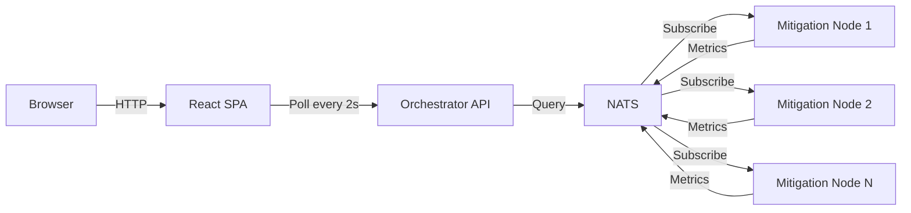

## Overview

The SecBeat Dashboard provides a **real-time web interface** for monitoring and managing your mitigation fleet, making the invisible kernel-level operations visible and actionable.

## Why a Dashboard?

**SecBeat's Backend Sophistication:**
- Kernel-level packet filtering (Extended Berkeley Packet Filter (eBPF)/eXpress Data Path (XDP))
- WebAssembly (WASM) runtime for dynamic rules
- Machine Learning (ML)-powered anomaly detection
- Distributed state with Conflict-Free Replicated Data Types (CRDTs)
- Multi-node orchestration

**The Problem**: All this runs **invisibly** at kernel level. Stakeholders can't see it working.

**The Solution**: Dashboard "makes the invisible visible" - transforming sophisticated technology into a demonstrable product.

## Architecture



**Data Flow:**
1. Mitigation nodes publish metrics to NATS (1s interval)
2. Orchestrator aggregates fleet state in memory
3. React frontend polls orchestrator Application Programming Interface (API) (2s interval)
4. Dashboard renders real-time updates

## Features

### 1. Fleet Overview

**Endpoint**: `GET /api/v1/dashboard/summary`

```json
{
  "total_requests": 12547893,
  "blocked_requests": 342156,
  "active_nodes": 10,
  "cluster_health": "healthy",
  "uptime_seconds": 86400,
  "current_pps": 125000,
  "block_rate_percent": 2.7
}
```

**Dashboard View:**
```
┌─────────────────────────────────┐
│     Fleet Performance          │
├─────────────────────────────────┤
│ Total Requests:  12.5M         │
│ Blocked:         342K (2.7%)   │
│ Active Nodes:    10 / 10       │
│ Throughput:      125K pps      │
│ Uptime:          24h 0m        │
└─────────────────────────────────┘
```

### 2. Node Management

**Endpoint**: `GET /api/v1/nodes`

```json
{
  "nodes": [
    {
      "id": "node-1",
      "ip": "10.0.1.10",
      "status": "healthy",
      "cpu_percent": 34.2,
      "memory_mb": 512,
      "pps": 12500,
      "blocks_total": 34215,
      "uptime_seconds": 86400,
      "last_heartbeat": "2025-11-24T01:00:00Z"
    }
  ]
}
```

**Dashboard View:**
```
Node ID    Status    CPU    Memory   PPS     Blocks
───────────────────────────────────────────
node-1     ✅        34%    512MB    12.5K   34.2K
node-2     ✅        28%    480MB    11.2K   28.9K
node-3     ⚠️        67%    890MB    8.1K    41.5K  ← High CPU
```

### 3. Attack Monitoring

**Endpoint**: `GET /api/v1/dashboard/attacks`

```json
{
  "attacks": [
    {
      "id": "attack-123",
      "type": "syn_flood",
      "source_ip": "203.0.113.42",
      "target_port": 443,
      "pps": 50000,
      "duration_seconds": 120,
      "status": "mitigated",
      "blocked_packets": 6000000,
      "detected_at": "2025-11-24T00:58:00Z"
    },
    {
      "id": "attack-124",
      "type": "http_flood",
      "source_ips": ["203.0.113.50", "203.0.113.51"],
      "target_uri": "/api/login",
      "rps": 10000,
      "duration_seconds": 45,
      "status": "active",
      "blocked_requests": 450000,
      "detected_at": "2025-11-24T01:00:15Z"
    }
  ]
}
```

**Dashboard View:**
```
Active Attacks
──────────────
🔴 HyperText Transfer Protocol (HTTP) Flood
   Source: 203.0.113.50 + 1 other
   Target: /api/login
   Rate: 10K rps
   Duration: 45s
   Blocked: 450K requests

Recent Attacks
──────────────
✅ SYN Flood (mitigated)
   Source: 203.0.113.42
   Duration: 2m
   Blocked: 6M packets
```

## React Frontend

### Components

**1. Dashboard.tsx** (Main Overview)
```tsx
import { useEffect, useState } from 'react';

function Dashboard() {
  const [summary, setSummary] = useState(null);
  
  useEffect(() => {
    const fetchSummary = async () => {
      const res = await fetch('http://orchestrator:8080/api/v1/dashboard/summary');
      const data = await res.json();
      setSummary(data);
    };
    
    fetchSummary();
    const interval = setInterval(fetchSummary, 2000);  // Poll every 2s
    return () => clearInterval(interval);
  }, []);
  
  return (
    <div className="dashboard">
      <MetricCard title="Total Requests" value={summary?.total_requests} />
      <MetricCard title="Blocked" value={summary?.blocked_requests} />
      <MetricCard title="Active Nodes" value={summary?.active_nodes} />
      <MetricCard title="Throughput" value={`${summary?.current_pps} pps`} />
    </div>
  );
}
```

**2. Nodes.tsx** (Fleet Management)
```tsx
function Nodes() {
  const [nodes, setNodes] = useState([]);
  
  useEffect(() => {
    const fetchNodes = async () => {
      const res = await fetch('http://orchestrator:8080/api/v1/nodes');
      const data = await res.json();
      setNodes(data.nodes);
    };
    
    fetchNodes();
    const interval = setInterval(fetchNodes, 2000);
    return () => clearInterval(interval);
  }, []);
  
  return (
    <table className="nodes-table">
      <thead>
        <tr>
          <th>Node ID</th>
          <th>Status</th>
          <th>Central Processing Unit (CPU)</th>
          <th>Memory</th>
          <th>PPS</th>
        </tr>
      </thead>
      <tbody>
        {nodes.map(node => (
          <tr key={node.id} className={node.status}>
            <td>{node.id}</td>
            <td>{node.status}</td>
            <td>{node.cpu_percent}%</td>
            <td>{node.memory_mb}MB</td>
            <td>{node.pps}</td>
          </tr>
        ))}
      </tbody>
    </table>
  );
}
```

**3. Attacks.tsx** (Security Events)
```tsx
function Attacks() {
  const [attacks, setAttacks] = useState([]);
  
  useEffect(() => {
    const fetchAttacks = async () => {
      const res = await fetch('http://orchestrator:8080/api/v1/dashboard/attacks');
      const data = await res.json();
      setAttacks(data.attacks);
    };
    
    fetchAttacks();
    const interval = setInterval(fetchAttacks, 2000);
    return () => clearInterval(interval);
  }, []);
  
  return (
    <div className="attacks">
      <h2>Active Attacks</h2>
      {attacks.filter(a => a.status === 'active').map(attack => (
        <AttackCard key={attack.id} attack={attack} />
      ))}
      
      <h2>Recent Attacks</h2>
      {attacks.filter(a => a.status === 'mitigated').map(attack => (
        <AttackCard key={attack.id} attack={attack} />
      ))}
    </div>
  );
}
```

## Deployment

### Development Mode

```bash
cd dashboard
npm install
npm run dev

# Expected output:
# Vite dev server running at http://localhost:5173
```

### Production Build

```bash
# Build static assets
npm run build

# Expected output:
# dist/
#   index.html
#   assets/
#     index-abc123.js
#     index-def456.css

# Serve with nginx
cp -r dist/* /var/www/secbeat-dashboard/
```

### Nginx Configuration

```nginx
server {
    listen 80;
    server_name dashboard.secbeat.example.com;
    
    root /var/www/secbeat-dashboard;
    index index.html;
    
    # Proxy API requests to orchestrator
    location /api/ {
        proxy_pass http://orchestrator:8080;
        proxy_set_header Host $host;
    }
    
    # Serve React SPA
    location / {
        try_files $uri /index.html;
    }
}
```

## Configuration

```toml
# config.prod.toml
[dashboard]
enabled = true
port = 8080
cors_origins = ["https://dashboard.secbeat.example.com"]

[dashboard.metrics]
publish_interval_seconds = 1  # Publish to NATS every second
retention_seconds = 300  # Keep 5 minutes of history

[dashboard.api]
max_attacks_returned = 50  # Limit attack history
max_nodes_returned = 100  # Limit node list
```

## Security

### Authentication (Future)

```toml
[dashboard.auth]
type = "oauth2"  # Or "jwt", "basic"
provider = "auth0"
client_id = "your-client-id"
```

### Transport Layer Security (TLS)

```toml
[dashboard.tls]
enabled = true
cert_file = "/etc/secbeat/dashboard.crt"
key_file = "/etc/secbeat/dashboard.key"
```

## Troubleshooting

### Dashboard Shows Stale Data

**Symptom**: Node status doesn't update

**Cause**: NATS connectivity issues

**Solution**:
```bash
# Check NATS connection
curl http://orchestrator:8080/api/v1/health

# Expected output:
# {"nats": "connected", "nodes": 10}
```

### High Memory Usage

**Symptom**: Orchestrator memory grows over time

**Cause**: Unbounded metrics retention

**Solution**:
```toml
[dashboard.metrics]
retention_seconds = 60  # Reduce retention window
```

## Learn More

- [Orchestrator API Reference](/reference/api#orchestrator)
- [Distributed State](/enterprise/distributed-state)
- [Multi-Region Deployment](/enterprise/multi-region)
