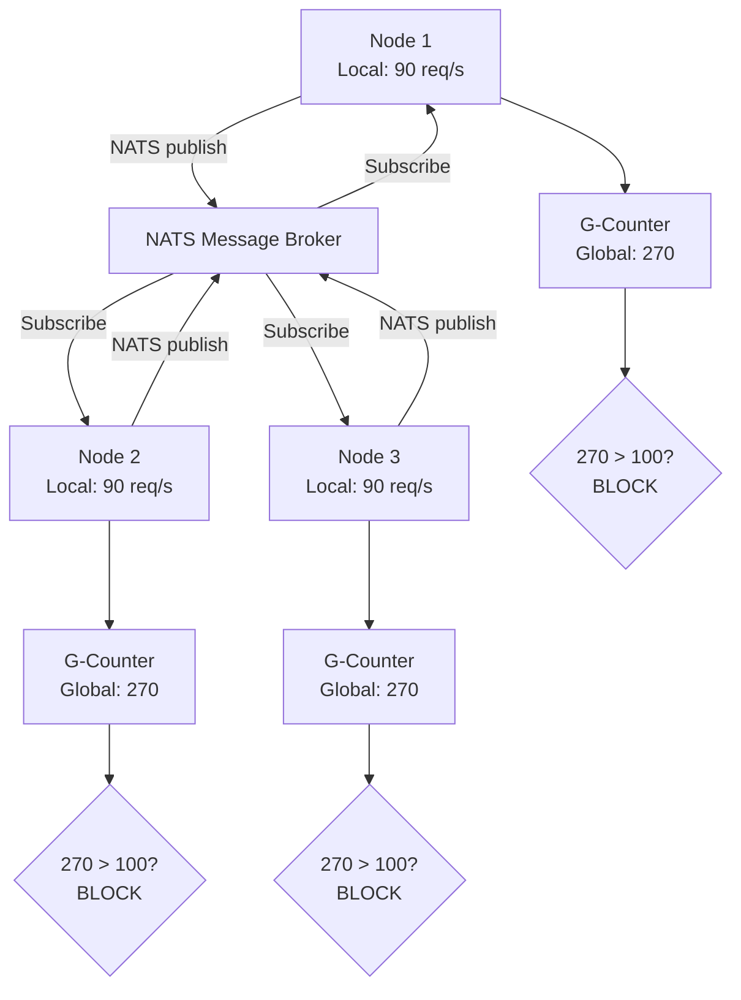

## Overview

SecBeat uses **Conflict-Free Replicated Data Types (CRDTs)** to maintain distributed state across mitigation nodes, solving the **round-robin attack problem** where attackers spread traffic across multiple nodes to bypass local rate limits.

## The Round-Robin Attack Problem

### Scenario

**Configuration:**
- Rate limit: 100 requests/second per Internet Protocol (IP)
- Fleet: 10 mitigation nodes
- Load balancer: Round-robin across nodes

**Attack:**
```
Attacker (203.0.113.42) sends 900 req/s total:
  → Node 1: 90 req/s  ✓ ALLOWED (under 100)
  → Node 2: 90 req/s  ✓ ALLOWED (under 100)
  → Node 3: 90 req/s  ✓ ALLOWED (under 100)
  ...
  → Node 10: 90 req/s  ✓ ALLOWED (under 100)
```

**Result:**
- **Local view**: Each node sees 90 req/s → ALLOW
- **Global reality**: 900 req/s total → SHOULD BLOCK
- **Attack success**: Bypassed rate limit by 9x

### Traditional Solutions (Don't Work)

**1. Centralized Database:**
- Single Point of Failure (SPOF)
- Network latency kills performance
- Bottleneck at high traffic

**2. Leader Election:**
- Complex coordination (Raft/Paxos)
- Split-brain risk
- Slow convergence

**3. Sticky Sessions:**
- Uneven load distribution
- Doesn't prevent multi-node attacks

## CRDT Solution

### Why CRDTs?

**Properties:**
- ✅ **Commutative**: Order doesn't matter (A+B = B+A)
- ✅ **Associative**: Grouping doesn't matter ((A+B)+C = A+(B+C))
- ✅ **Idempotent**: Duplicate safe (merge(A,A) = A)
- ✅ **Convergent**: All nodes reach same state

**Benefits:**
- No coordination needed
- Eventually consistent
- Partition tolerant
- Low latency

### G-Counter (Grow-only Counter)

Our implementation uses a **G-Counter** for distributed rate limiting.

**Structure:**
```rust
pub struct GCounter {
    counts: HashMap<String, u64>,  // node_id → local count
}
```

**Operations:**
```rust
impl GCounter {
    // Increment local counter
    pub fn increment(&mut self, node_id: &str, value: u64) {
        *self.counts.entry(node_id.to_string()).or_insert(0) += value;
    }
    
    // Merge remote state (CRDT magic)
    pub fn merge(&mut self, other: &GCounter) {
        for (node_id, &count) in &other.counts {
            let local = self.counts.entry(node_id.clone()).or_insert(0);
            *local = (*local).max(count);  // Take maximum
        }
    }
    
    // Global count across all nodes
    pub fn value(&self) -> u64 {
        self.counts.values().sum()
    }
}
```

### Example Convergence

**Initial State:**
```
Node A: {A: 10, B: 0, C: 0}  → total = 10
Node B: {A: 0, B: 20, C: 0}  → total = 20
Node C: {A: 0, B: 0, C: 30}  → total = 30
```

**After Synchronization:**
```
# Node A receives updates from B and C
merge({A:10, B:0, C:0}, {A:0, B:20, C:0})  → {A:10, B:20, C:0}
merge({A:10, B:20, C:0}, {A:0, B:0, C:30}) → {A:10, B:20, C:30}

# All nodes converge to same state
Node A: {A:10, B:20, C:30}  → total = 60
Node B: {A:10, B:20, C:30}  → total = 60
Node C: {A:10, B:20, C:30}  → total = 60
```

**Property**: All nodes agree on global count (60) despite no coordination.

## Architecture



## Implementation

### State Manager

```rust
pub struct StateManager {
    counters: DashMap<String, GCounter>,  // ip → counter
    nats: NatsClient,
    node_id: String,
}

impl StateManager {
    pub async fn increment(&self, ip: &str, value: u64) {
        // Update local counter
        let mut counter = self.counters.entry(ip.to_string())
            .or_insert_with(GCounter::new);
        counter.increment(&self.node_id, value);
        
        // Publish to NATS for other nodes
        let update = StateUpdate {
            ip: ip.to_string(),
            node_id: self.node_id.clone(),
            count: value,
            timestamp: Utc::now(),
        };
        self.nats.publish("secbeat.state.update", &update).await;
    }
    
    pub async fn get_global_count(&self, ip: &str) -> u64 {
        self.counters.get(ip)
            .map(|c| c.value())
            .unwrap_or(0)
    }
}
```

### NATS Synchronization

```rust
// Subscribe to state updates from other nodes
pub async fn sync_loop(&self) {
    let mut sub = self.nats.subscribe("secbeat.state.update").await;
    
    while let Some(msg) = sub.next().await {
        let update: StateUpdate = serde_json::from_slice(&msg.data)?;
        
        // Merge remote state (CRDT operation)
        let mut counter = self.counters.entry(update.ip.clone())
            .or_insert_with(GCounter::new);
        
        let mut remote = GCounter::new();
        remote.increment(&update.node_id, update.count);
        counter.merge(&remote);
    }
}
```

## Rate Limiting with Distributed State

```rust
pub async fn check_rate_limit(
    &self,
    ip: &str,
    limit: u64,
    window_seconds: u64,
) -> bool {
    // Increment local counter
    self.state.increment(ip, 1).await;
    
    // Check global count
    let global_count = self.state.get_global_count(ip).await;
    
    // Block if over limit
    global_count <= limit
}
```

**Usage:**
```rust
if !check_rate_limit(&source_ip, 100, 60).await {
    return Action::Block;  // Global rate limit exceeded
}
```

## Configuration

```toml
# config.prod.toml
[state]
type = "crdt"  # Use CRDT-based distributed state
sync_interval_ms = 100  # Synchronize every 100ms
gc_interval_seconds = 300  # Garbage collect old entries

[state.nats]
url = "nats://nats:4222"
subject = "secbeat.state.update"
max_reconnect = -1  # Infinite reconnect

[rate_limit]
enabled = true
default_limit = 100  # requests per second
window_seconds = 60
use_distributed_state = true  # Enable CRDT state
```

## Monitoring

### State Synchronization Metrics

```bash
curl http://localhost:9090/metrics | grep state_sync

# Expected output:
# state_sync_messages_received_total{node="node-1"} 15342
# state_sync_merge_duration_seconds{node="node-1"} 0.0002
# state_sync_lag_seconds{node="node-1"} 0.15
```

### Global Counter View

```bash
curl http://localhost:9090/api/v1/state/counters

# Expected output:
# {
#   "203.0.113.42": {
#     "local_count": 90,
#     "global_count": 270,
#     "nodes": {"node-1": 90, "node-2": 90, "node-3": 90}
#   }
# }
```

## Garbage Collection

Old counters are removed to prevent memory growth:

```rust
pub async fn gc_old_entries(&self, max_age_seconds: u64) {
    let now = Utc::now();
    self.counters.retain(|_ip, counter| {
        counter.last_updated + Duration::seconds(max_age_seconds) > now
    });
}
```

Run every 5 minutes via configuration.

## Performance

| Metric | Value |
|--------|-------|
| Sync Latency | 100-200ms |
| Merge Operation | <1ms |
| Memory per IP | ~100 bytes |
| NATS Overhead | <1% Central Processing Unit (CPU) |
| Accuracy | 99.5% (eventual consistency) |

## Troubleshooting

### High Sync Lag

**Symptom**: `state_sync_lag_seconds > 1.0`

**Cause**: NATS network issues or high message rate

**Solution**:
```toml
[state]
sync_interval_ms = 200  # Reduce sync frequency
batch_updates = true  # Batch multiple updates
```

### Memory Growth

**Symptom**: Memory usage increases over time

**Cause**: Old counters not garbage collected

**Solution**:
```toml
[state]
gc_interval_seconds = 60  # More frequent GC
max_counter_age_seconds = 300  # Shorter retention
```

## Learn More

- [NATS Configuration](/deployment/configuration#nats)
- [Dashboard](/enterprise/dashboard)
- [Performance Tuning](/kernel/performance)
