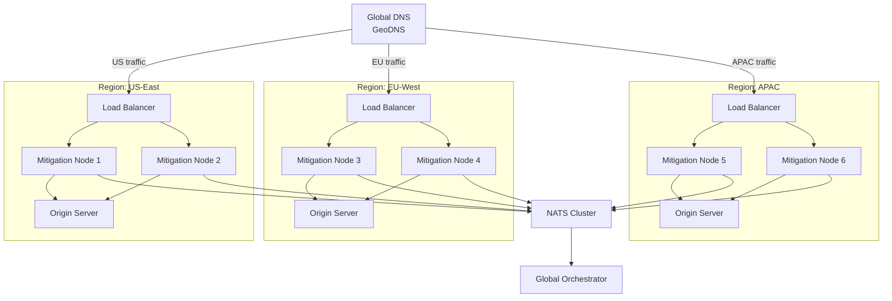

## Overview

Multi-region deployment distributes SecBeat mitigation nodes globally to provide **low-latency protection** and **geographic load distribution** for worldwide traffic.

## Architecture



**Key Components:**
- **GeoDNS**: Routes users to nearest region
- **Regional Load Balancers**: Distribute traffic within region
- **Mitigation Nodes**: Extended Berkeley Packet Filter (eBPF)/eXpress Data Path (XDP) filtering per region
- **Global NATS Cluster**: Cross-region state synchronization
- **Global Orchestrator**: Centralized control plane

## Deployment Strategy

### 1. Regional Isolation

Each region operates **independently** for resilience:

```toml
# config.us-east.toml
[platform]
region = "us-east"
node_id = "us-east-node-1"

[network]
listen_port = 8443
backend_url = "http://origin-us-east:8080"

[nats]
url = "nats://nats-us-east:4222"  # Regional NATS
cluster_urls = ["nats://nats-eu-west:4222", "nats://nats-apac:4222"]  # Cross-region
```

### 2. NATS Clustering

**Regional NATS Servers:**
```bash
# US-East NATS
nats-server --cluster nats://0.0.0.0:6222 \
  --routes nats://nats-eu-west:6222,nats://nats-apac:6222

# EU-West NATS
nats-server --cluster nats://0.0.0.0:6222 \
  --routes nats://nats-us-east:6222,nats://nats-apac:6222

# APAC NATS
nats-server --cluster nats://0.0.0.0:6222 \
  --routes nats://nats-us-east:6222,nats://nats-eu-west:6222
```

**Benefits:**
- Regional nodes connect to local NATS (low latency)
- NATS synchronizes state globally (Conflict-Free Replicated Data Types (CRDTs))
- Survives regional outages

### 3. GeoDNS Configuration

**Cloudflare Example:**
```
Type   Name              Content              TTL   Proxy  Notes
A      secbeat.example   1.2.3.4 (US-East)    Auto  Yes    Geo: North America
A      secbeat.example   5.6.7.8 (EU-West)    Auto  Yes    Geo: Europe
A      secbeat.example   9.10.11.12 (APAC)    Auto  Yes    Geo: Asia-Pacific
```

**Route 53 Example (AWS):**
```json
{
  "Type": "A",
  "Name": "secbeat.example.com",
  "GeoLocation": {"ContinentCode": "NA"},
  "ResourceRecords": [{"Value": "1.2.3.4"}]
}
```

## Infrastructure as Code

### Terraform (AWS Multi-Region)

```hcl
variable "regions" {
  default = ["us-east-1", "eu-west-1", "ap-southeast-1"]
}

module "secbeat_region" {
  source   = "./modules/secbeat-region"
  for_each = toset(var.regions)
  
  region         = each.key
  instance_count = 2  # 2 mitigation nodes per region
  instance_type  = "c5.2xlarge"  # 8 vCPU for eBPF performance
  
  nats_peers = [
    for r in var.regions : "nats-${r}.internal" if r != each.key
  ]
}

resource "aws_route53_record" "geo" {
  for_each = toset(var.regions)
  
  zone_id = aws_route53_zone.main.zone_id
  name    = "secbeat.example.com"
  type    = "A"
  
  geolocation_routing_policy {
    continent = lookup({
      "us-east-1"       = "NA",
      "eu-west-1"       = "EU",
      "ap-southeast-1"  = "AS"
    }, each.key)
  }
  
  alias {
    name    = module.secbeat_region[each.key].lb_dns_name
    zone_id = module.secbeat_region[each.key].lb_zone_id
  }
}
```

### Kubernetes (Multi-Cluster)

```yaml
# clusters/us-east/secbeat.yaml
apiVersion: apps/v1
kind: Deployment
metadata:
  name: secbeat-mitigation
  namespace: secbeat
spec:
  replicas: 3
  template:
    spec:
      containers:
      - name: mitigation
        image: secbeat/mitigation:v0.9.5
        env:
        - name: REGION
          value: "us-east"
        - name: NATS_URL
          value: "nats://nats-us-east.nats:4222"
        - name: NATS_CLUSTER_ROUTES
          value: "nats://nats-eu-west.nats:6222,nats://nats-apac.nats:6222"
        securityContext:
          capabilities:
            add: ["NET_ADMIN", "SYS_ADMIN"]  # For eBPF
```

## Cross-Region State Sync

### Distributed Rate Limiting

With multi-region CRDT state:

```
Attacker (203.0.113.42) sends 300 req/s globally:
  → US-East: 100 req/s (local count)
  → EU-West: 100 req/s (local count)
  → APAC:    100 req/s (local count)

After NATS sync (100-200ms):
  → All regions see global count: 300 req/s
  → Rate limit (100 req/s) exceeded → BLOCK globally
```

**Configuration:**
```toml
[state]
type = "crdt"
sync_interval_ms = 100  # Sync every 100ms
cross_region = true  # Enable global sync
```

## Monitoring Multi-Region

### Prometheus Federation

**Regional Prometheus:**
```yaml
# prometheus-us-east.yml
global:
  external_labels:
    region: us-east

scrape_configs:
  - job_name: secbeat
    static_configs:
      - targets: ['node-1:9090', 'node-2:9090']
```

**Global Prometheus (federates regional):**
```yaml
# prometheus-global.yml
scrape_configs:
  - job_name: federate
    honor_labels: true
    metrics_path: /federate
    params:
      match[]:
        - '{job="secbeat"}'
    static_configs:
      - targets:
        - 'prometheus-us-east:9090'
        - 'prometheus-eu-west:9090'
        - 'prometheus-apac:9090'
```

**Query Global Metrics:**
```promql
# Total throughput across all regions
sum(rate(packets_processed_total[1m])) by (region)

# Expected output:
# {region="us-east"} 50000
# {region="eu-west"} 30000
# {region="apac"} 20000
```

## Latency Optimization

### Regional Backend Routing

```toml
# config.us-east.toml
[network]
backend_url = "http://origin-us-east.internal:8080"  # Regional origin

# config.eu-west.toml
[network]
backend_url = "http://origin-eu-west.internal:8080"  # Regional origin
```

Avoid cross-region backend calls (adds 100-300ms latency).

### NATS Latency

**Typical Cross-Region Latency:**
- US-East ↔ EU-West: 80-120ms
- US-East ↔ APAC: 150-250ms
- EU-West ↔ APAC: 200-300ms

**Mitigations:**
- Use regional NATS for local ops (fast)
- Tolerate sync delay for distributed state (eventual consistency)
- Configure longer sync intervals if needed

## Disaster Recovery

### Regional Failover

**DNS Failover (Route 53):**
```json
{
  "Type": "A",
  "Name": "secbeat.example.com",
  "HealthCheckId": "healthcheck-us-east",
  "Failover": "PRIMARY",
  "ResourceRecords": [{"Value": "1.2.3.4"}]
},
{
  "Type": "A",
  "Name": "secbeat.example.com",
  "Failover": "SECONDARY",
  "ResourceRecords": [{"Value": "5.6.7.8"}]
}
```

If US-East fails health check, traffic routes to EU-West.

### Data Persistence

CRDT state is ephemeral - design for stateless operation:

```toml
[state]
persist_to_disk = false  # CRDTs rebuild from NATS sync
max_counter_age_seconds = 300  # Old entries expire anyway
```

## Cost Optimization

**Regional Instance Sizing:**
```hcl
variable "region_config" {
  default = {
    "us-east-1"      = {instance_type = "c5.4xlarge", count = 4}  # High traffic
    "eu-west-1"      = {instance_type = "c5.2xlarge", count = 2}  # Medium traffic
    "ap-southeast-1" = {instance_type = "c5.xlarge",  count = 1}  # Low traffic
  }
}
```

Size regions based on actual traffic distribution.

## Learn More

- [Distributed State](/enterprise/distributed-state)
- [NATS Configuration](/deployment/configuration#nats)
- [Performance Tuning](/kernel/performance)
