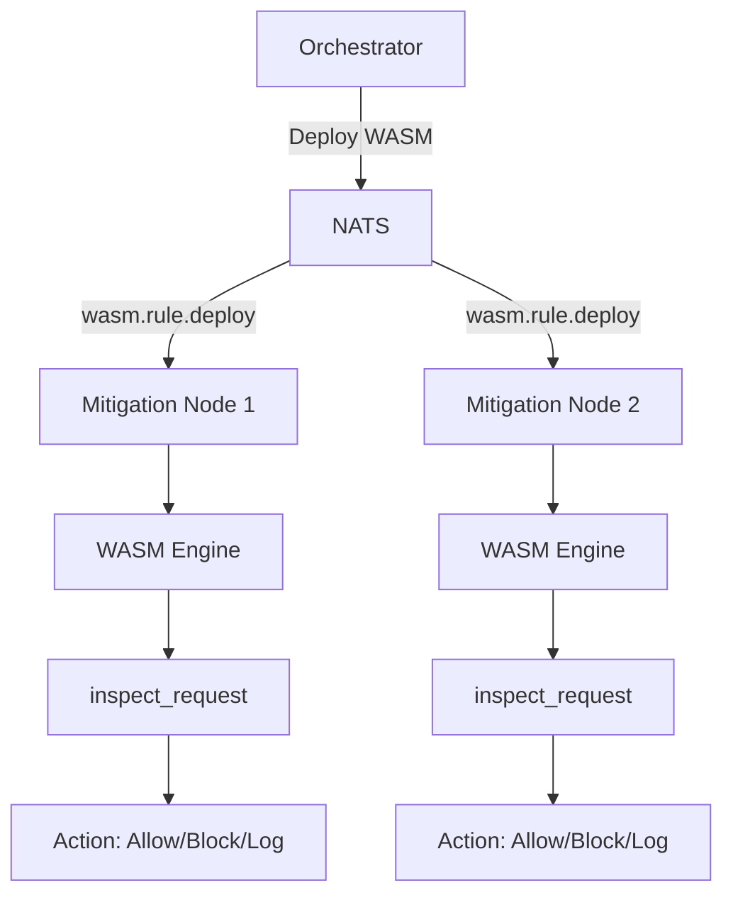

## Overview

SecBeat uses WebAssembly (WASM) to enable **hot-reloadable Web Application Firewall (WAF) rules** without recompiling or restarting the mitigation node.

## Why WASM for Security Rules?

**Traditional WAF Limitations:**
- Rule changes require recompilation
- Service restart causes downtime
- No isolation between rules and core system
- Manual deployment coordination

**WASM Runtime Benefits:**
- ✅ Load rules dynamically at runtime
- ✅ Hot-swap modules without restart
- ✅ Sandboxed execution with resource limits
- ✅ Near-native performance (~6K-15K Central Processing Unit (CPU) instructions per request)
- ✅ Distributed deployment via NATS

## Architecture



Requests flow through the WASM engine which executes `inspect_request()` and returns an action.

## WASM Module Interface

### Actions

```rust
#[repr(i32)]
pub enum Action {
    Allow = 0,       // Pass request through
    Block = 1,       // Drop/reject request
    Log = 2,         // Log but allow (passive mode)
    RateLimit = 3,   // Apply rate limiting
}
```

### Request Context

JSON structure passed to WASM module:

```json
{
  "method": "POST",
  "uri": "/api/login",
  "version": "HTTP/1.1",
  "source_ip": "203.0.113.42",
  "headers": {
    "user-agent": "BadBot/1.0",
    "content-type": "application/json"
  },
  "body": "{\"username\": \"admin\", \"password\": \"' OR '1'='1\"}"
}
```

### Required Export

WASM modules must export:

```rust
#[no_mangle]
pub extern "C" fn inspect_request(ptr: *const u8, len: usize) -> i32 {
    // Parse RequestContext from memory
    // Apply security rules
    // Return Action as i32
}
```

## Resource Limits

**Fuel Limit**: 100,000 instructions per request
- Prevents infinite loops
- Ensures bounded execution time
- Typical rule uses 6K-15K instructions

**Memory Limit**: 1 MB per WASM instance
- Prevents memory exhaustion
- Shared across all requests in module

## Example: Bad Bot Blocker

```rust
// wasm-rules/bad-bot-blocker/src/lib.rs
use serde::{Deserialize, Serialize};

#[derive(Deserialize)]
struct RequestContext {
    method: String,
    uri: String,
    headers: HashMap<String, String>,
}

#[no_mangle]
pub extern "C" fn inspect_request(ptr: *const u8, len: usize) -> i32 {
    let data = unsafe { std::slice::from_raw_parts(ptr, len) };
    let ctx: RequestContext = serde_json::from_slice(data).unwrap();
    
    // Block admin paths
    if ctx.uri.starts_with("/admin") {
        return 1; // Block
    }
    
    // Block known bad bots
    if let Some(ua) = ctx.headers.get("user-agent") {
        let bad_bots = ["BadBot", "SQLMap", "Nmap", "Nikto"];
        if bad_bots.iter().any(|bot| ua.contains(bot)) {
            return 1; // Block
        }
    }
    
    0 // Allow
}
```

## Build and Deploy

### Compile WASM Module

```bash
# Build WASM module
cd wasm-rules/bad-bot-blocker
cargo build --target wasm32-unknown-unknown --release

# Expected output:
# Compiling bad-bot-blocker v0.1.0
# Finished release [optimized] target(s)

# Optimize with wasm-opt
wasm-opt -Oz -o optimized.wasm \
  target/wasm32-unknown-unknown/release/bad_bot_blocker.wasm

# Check size (should be <100 KB)
ls -lh optimized.wasm
# Expected output:
# -rw-r--r--  1 user  staff    85K Nov 24 01:00 optimized.wasm
```

### Load into Mitigation Node

```bash
# Load WASM module via API
curl -X POST http://localhost:9090/api/v1/wasm/load \
  -F "name=bad-bot-blocker" \
  -F "file=@optimized.wasm"

# Expected output:
# {"success": true, "message": "Module loaded successfully"}

# Verify module is active
curl http://localhost:9090/api/v1/wasm/modules

# Expected output:
# {"modules": [{"name": "bad-bot-blocker", "size": 87040, "loaded_at": "2025-11-24T01:00:00Z"}]}
```

### Test the Rule

```bash
# Test with bad bot User-Agent
curl -H "User-Agent: BadBot/1.0" http://localhost:8443/

# Expected output:
# HTTP/1.1 403 Forbidden
# Blocked by WASM rule: bad-bot-blocker

# Test with legitimate User-Agent
curl -H "User-Agent: Mozilla/5.0" http://localhost:8443/

# Expected output:
# HTTP/1.1 200 OK
# (proxied to backend)
```

## Performance

| Metric | Value |
|--------|-------|
| Module Load Time | ~10ms |
| Per-Request Overhead | <100µs |
| Fuel Cost (typical) | 6K-15K instructions |
| Memory Usage | <1MB per module |
| Throughput Impact | <5% at 10K req/s |

## Hot Reload

Update rules without restarting:

```bash
# Rebuild module with new rules
cargo build --target wasm32-unknown-unknown --release
wasm-opt -Oz -o updated.wasm target/wasm32-unknown-unknown/release/*.wasm

# Reload module (replaces existing)
curl -X POST http://localhost:9090/api/v1/wasm/reload \
  -F "name=bad-bot-blocker" \
  -F "file=@updated.wasm"

# Expected output:
# {"success": true, "message": "Module reloaded", "downtime_ms": 0}
```

No requests are dropped during reload - the engine swaps modules atomically.

## Distributed Deployment

Deploy WASM module fleet-wide via NATS:

```bash
# From orchestrator node
curl -X POST http://orchestrator:8080/api/v1/wasm/deploy \
  -F "file=@bad-bot-blocker.wasm" \
  -F "target=all"  # or specific node IDs

# Expected output:
# {"success": true, "deployed_to": ["node-1", "node-2", "node-3"]}
```

All mitigation nodes receive and load the module within seconds.

## Security Considerations

**WASM Sandbox**:
- No file system access
- No network access
- No system calls
- Memory isolated from host

**Validation**:
- Verify WASM module signature (future)
- Enforce fuel limits
- Monitor execution time

## Troubleshooting

### Module Fails to Load

**Error**: `Invalid WASM module`

**Cause**: Missing required export or invalid binary

**Solution**:
```bash
# Verify exports
wasm-objdump -x module.wasm | grep inspect_request

# Expected output:
# - func[0] <inspect_request>
```

### High Fuel Consumption

**Symptom**: Requests timing out or getting rejected

**Cause**: Rule logic too complex

**Solution**: Optimize rule or increase fuel limit in config:
```toml
[waf.wasm]
fuel_limit = 200000  # Increase from 100K
```

## Learn More

- [Dynamic Rules](/intelligence/dynamic-rules)
- [Hot Reload Guide](/intelligence/hot-reload)
- [WAF Configuration](/core/waf)
