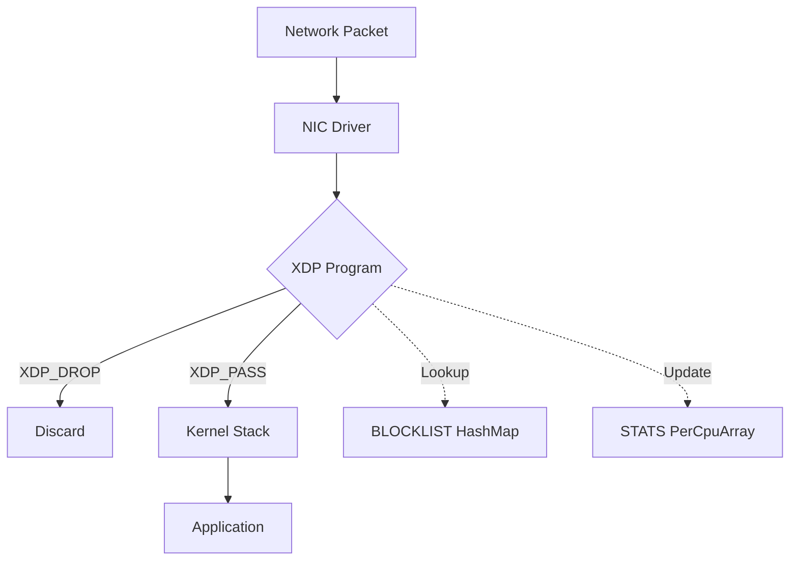

## Overview

eXpress Data Path (XDP) enables ultra-fast packet processing by executing Extended Berkeley Packet Filter (eBPF) programs directly in the network driver, before packets reach the kernel network stack.

## SecBeat XDP Implementation

### Use Cases

- **SYN Flood Mitigation**: Drop attack packets at line rate (10M+ packets/second)
- **IP Blocklisting**: Block malicious IPs with <1µs latency
- **Traffic Sampling**: Monitor patterns with minimal overhead

### Performance

| Metric | Value |
|--------|-------|
| Throughput | 10M+ pps per CPU core |
| Latency | <1µs per packet |
| CPU Usage | <5% at 1Gbps |
| Memory | <2MB (kernel maps) |

## XDP Actions

SecBeat XDP programs return these verdict codes:

```rust
match blocklist.get(&ip_key) {
    Some(_) => xdp_action::XDP_DROP,  // Block malicious IP
    None => xdp_action::XDP_PASS,     // Allow legitimate traffic
}
```

**Available Actions:**
- `XDP_PASS` - Allow packet to kernel network stack
- `XDP_DROP` - Drop packet immediately (used for blocking)
- `XDP_TX` - Bounce packet back to sender
- `XDP_REDIRECT` - Forward to different interface

## eBPF Maps

### Blocklist HashMap

Stores blocked IP addresses for O(1) lookup:

```rust
#[map]
static BLOCKLIST: HashMap<u32, u8> = HashMap::with_max_entries(10000, 0);
```

- **Key**: IPv4 address (u32, network byte order)
- **Value**: Block reason code (u8)
- **Capacity**: 10,000 IPs (configurable)
- **Lookup Time**: 50-100ns

### Statistics PerCpuArray

Tracks packet counters without atomic operations:

```rust
#[map]
static STATS: PerCpuArray<u64> = PerCpuArray::with_max_entries(2, 0);
```

- **Index 0**: Total packets passed
- **Index 1**: Total packets dropped
- **Per-CPU**: Eliminates contention across cores

## Example Usage

### Block an IP Address

```bash
# Add IP to XDP blocklist via API
curl -X POST http://localhost:9090/api/v1/blocklist \
  -H "Content-Type: application/json" \
  -d '{"ip": "203.0.113.42", "reason": "brute_force"}'

# Expected output:
# {"success": true, "message": "IP added to blocklist"}
```

Packets from this IP are now dropped at the XDP layer, consuming <100ns of Central Processing Unit (CPU) time.

### Verify XDP Program

```bash
# Check if XDP program is attached
sudo bpftool prog list | grep secbeat

# Expected output:
# 42: xdp  name secbeat_xdp  tag a1b2c3d4e5f6g7h8

# View blocklist contents
sudo bpftool map dump name BLOCKLIST

# Expected output:
# key: c0 a8 64 0c  value: 01
# Found 1 element
```

## Requirements

### Kernel

- Linux kernel **5.15+** with these configs:
  ```
  CONFIG_BPF=y
  CONFIG_BPF_SYSCALL=y
  CONFIG_XDP_SOCKETS=y
  ```

### Capabilities

```bash
# Grant required capabilities to binary
sudo setcap cap_net_admin,cap_bpf=eip ./mitigation-node
```

### Network Driver

Verify your Network Interface Card (NIC) supports XDP:

```bash
# Check XDP support
ethtool -k eth0 | grep xdp

# Expected output:
# generic-xdp: on
# native-xdp: on
```

Most modern drivers (Intel ixgbe, Mellanox mlx5) support native XDP.

## Architecture



Packets are evaluated **before** socket buffer allocation, saving thousands of CPU cycles per dropped packet.

## Troubleshooting

### XDP Program Fails to Load

**Error**: `Operation not permitted`

**Cause**: Insufficient capabilities

**Solution**:
```bash
sudo setcap cap_net_admin,cap_bpf=eip ./mitigation-node
# OR run with sudo (not recommended for production)
sudo ./mitigation-node --mode xdp
```

### Stats Show Zero Despite Traffic

**Cause**: XDP program not attached to interface

**Solution**:
```bash
# Verify attachment
sudo bpftool net show

# Expected output should include:
# xdp:
# eth0(2) driver id 42
```

### Docker Container Cannot Load XDP

**Cause**: Docker-in-Docker lacks kernel access

**Solution**: Use native Linux or LXC containers. See [deployment guide](/installation#linux-native).

## Learn More

- [XDP Performance Tuning](/kernel/performance)
- [SYN Flood Protection](/core/syn-flood)
- [Observability & Metrics](/core/observability)
- [Linux XDP Documentation](https://www.kernel.org/doc/html/latest/networking/xdp.html)
